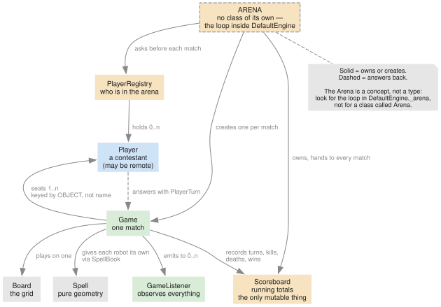
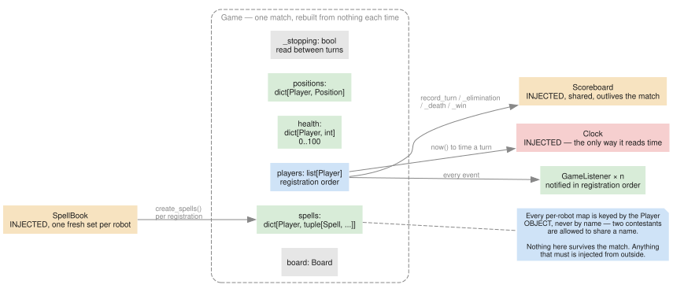
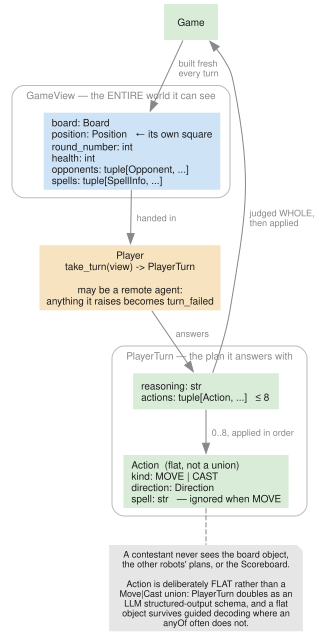
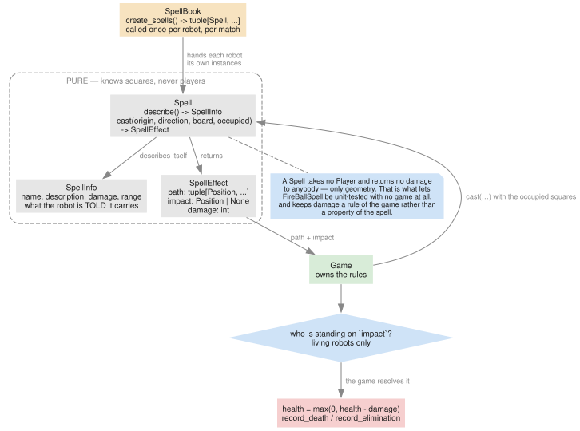
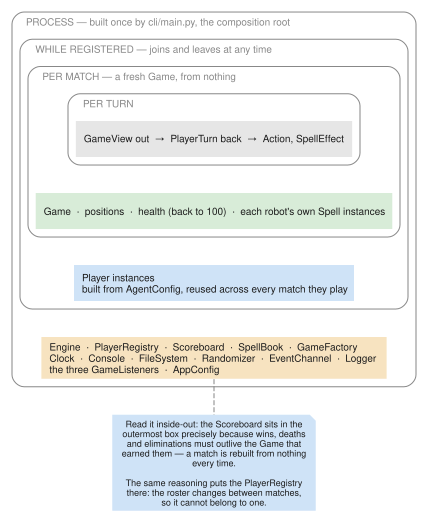
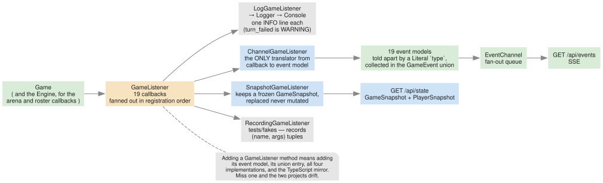
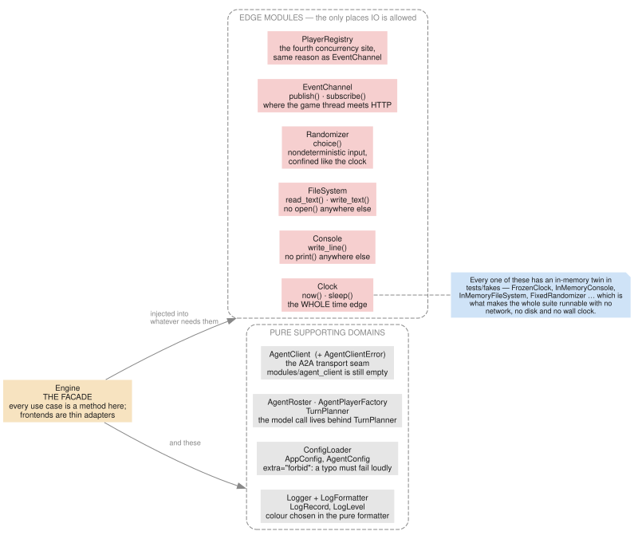

# Domain model

The concepts `agent-showdown` is built out of, what owns what, and how long each thing lives.
`docs/protocol/magic-robots-protocol.md` describes what crosses the wire; this describes what is
on this side of it.

## How to read this

The architecture splits every domain in two:

- **`interfaces/<domain>/`** is the vocabulary — `Protocol` classes and frozen Pydantic models,
  with no behaviour. It never imports from `modules/`.
- **`modules/<domain>/`** holds the implementations, under the same domain names.

Everything depends on the Protocol, never on the class, and `cli/main.py` is the only place that
knows which implementation is which. So the domain model *is* `interfaces/`, and the names below
are the names in that tree.

One warning before anything else. **The most important concept in the system has no class.** The
arena is a loop inside `DefaultEngine` plus a `PlayerRegistry`; searching for `class Arena` finds
nothing. Everything else here is a type you can open.

## The concepts

**Arena** — the thing that is always running. It plays matches back to back for as long as the
process lives, seating whoever is registered when each one starts. It has no state of its own
beyond "am I stopping", and it pauses when nobody is registered.

**Match** — one game on one board, from a standing start: full health, everyone on their seat. A
`Game` is a match. It is built from nothing each time and thrown away at the end.

**Round** — one pass through the contestants. Every living robot gets one turn per round, in an
order that rotates by one seat each round so leading is not a permanent advantage.

**Turn** — one robot's chance to act. It is handed a `GameView`, answers with a `PlayerTurn`, and
the game judges that plan whole before applying any of it.

**Action** — a single entry in a plan: a step in a direction, or a spell aimed down one. Up to
eight per turn, applied in order.

**Contestant** — a `Player`. It might be a local stand-in, an in-process LLM agent, or a remote
agent over HTTP; the game cannot tell and does not care.

**Spell** — something a robot carries and can cast. Pure geometry: it computes where a bolt
travels and what it stops on, and knows nothing about damage or players.



## The aggregates

### Arena — `DefaultEngine._arena` + `PlayerRegistry`

Not a type. The loop lives in `modules/engine/default_engine.py`; the roster it consults lives
behind `PlayerRegistry`. Together they own the one rule that has no other home: **an arena with
nobody in it pauses, and a registration wakes it.**

```python
class PlayerRegistry(Protocol):
    def register(self, player: Player) -> None: ...
    def unregister(self, name: str) -> bool: ...
    def players(self) -> tuple[Player, ...]: ...
    def await_players(self, timeout: float) -> bool: ...
```

`await_players` is what a paused arena blocks on, and `register` is what releases it. The registry
is consulted **before each match**, never during one, which is why a robot that joins mid-match
sits down for the next.

### `Game` — one match

```python
class Game(Protocol):
    def add_listener(self, listener: GameListener) -> None: ...
    def register_player(self, player: Player, position: Position) -> None: ...
    def start(self, max_rounds: int) -> None: ...
    def stop(self) -> None: ...
```

`DefaultGame` owns the rules and all per-match state: where everyone stands, what health they have
left, and which spell instances each is carrying.



Two things about it are worth stating plainly.

**Every per-robot map is keyed by the `Player` object, not by its name.** Two contestants are
allowed to share a name — nothing enforces uniqueness — so a name is not an identity. This is why
`Scoreboard` also keys by object.

**Nothing it owns survives the match.** A fresh `Game` is built per match, so anything that must
outlive one is injected: the `Scoreboard`, the `SpellBook`, the `Clock`, the listeners.

### `Player` — a contestant, and a trust boundary

```python
class Player(Protocol):
    def get_name(self) -> str: ...
    def take_turn(self, view: GameView) -> PlayerTurn: ...
```

Deliberately synchronous. A remote player blocks; nothing about that forces `async` onto `Game`,
`Engine` or the CLI, and the web frontend keeps the blocking game on a worker thread.

`take_turn` is the system's trust boundary. A `Player` may be a remote agent that hangs, crashes
or answers with nonsense, so `DefaultGame` wraps the call in a broad `except Exception` — that is
deliberate, not sloppy — and reports the result as `turn_failed` rather than letting one
contestant kill the match.



A contestant sees exactly what `GameView` carries and nothing else: not the board object, not the
other robots' plans, not the scoreboard.

#### The view does the geometry

`Opponent` carries `direction` and `distance` — worked out by the game rather than left to the
contestant. This is not a convenience. A bolt travels only along the eight directions, so it
reaches a robot only when that robot is on the same row, column or exact diagonal, and measured
over a real match **78% of casts were fired when no direction could have hit anything**. The
models are poor at that arithmetic; the game already knows the answer. Supplying it moved casts
that were aimed down a line with a target on them from 11% to 96%.

It belongs to the game because direction deltas are a rule of the board, and putting it in the
view means every kind of contestant benefits — a remote A2A agent gets it for free.

### `Spell` — geometry, and nothing else

```python
class Spell(Protocol):
    def describe(self) -> SpellInfo: ...
    def cast(self, origin: Position, direction: Direction,
             board: Board, occupied: frozenset[Position]) -> SpellEffect: ...
```

A spell takes no `Player` and inflicts no damage. It is given an origin, a direction, a board and
the set of occupied squares, and returns the path it travelled and the square it stopped on.
Mapping that square back to whoever stands there, and taking the health off them, is the game's
business.



That line is what lets `FireBallSpell` be unit-tested with no game around it, and what keeps
damage a rule of the game rather than a property of the word "fireball". `SpellBook` hands each
robot **its own instances**, so a future spell can carry a cooldown without two contestants
sharing it.

### `Scoreboard` — the only mutable thing

```python
class Scoreboard(Protocol):
    def record_turn(self, player: Player, seconds: float) -> None: ...
    def record_elimination(self, player: Player) -> None: ...
    def record_death(self, player: Player) -> None: ...
    def record_win(self, player: Player) -> None: ...
    def stats_for(self, player: Player) -> PlayerStats: ...
```

Everything else in the domain is a frozen model or a stateless computation. The scoreboard is
mutable because it is the thing that survives: a `Game` is rebuilt every match, so a win tally
kept there would reset every time. It is a singleton, handed to every match, and only the thread
playing touches it.

## Lifetimes

This is the section that explains why `Scoreboard` and `PlayerRegistry` exist at all.



| Lives for | What | Why |
|---|---|---|
| one turn | `GameView`, `PlayerTurn`, `Action`, `SpellEffect` | values, created and discarded |
| one match | `Game`, positions, health, each robot's `Spell` instances | a match starts from nothing |
| while registered | `Player` instances | reused across every match they play, so no model client is rebuilt |
| the process | `Engine`, `PlayerRegistry`, `Scoreboard`, `SpellBook`, `GameFactory`, the edge modules, the listeners, `AppConfig` | built once by `cli/main.py` |

## Value objects

All frozen (`ConfigDict(frozen=True)`): data, no behaviour.

| Type | Fields | Why it exists |
|---|---|---|
| `Position` | `x`, `y` | the single coordinate type the whole game speaks. `(0,0)` is top-left |
| `Board` | `width`, `height` | the grid. Cells are empty; robots are not on it, it is on them |
| `Direction` | `StrEnum`, 8 values | a step. **No `delta` property** — which way is "up" is a rule of the board, so the deltas live in `modules/game/deltas.py` |
| `ActionKind` | `MOVE`, `CAST` | what an entry in a plan does |
| `Action` | `kind`, `direction`, `spell` | one entry of a plan. **Flat, not a `Move \| Cast` union** — `PlayerTurn` doubles as an LLM structured-output schema, and a flat object survives guided decoding where an `anyOf` often does not. `spell` is ignored when `kind` is `MOVE` |
| `PlayerTurn` | `reasoning`, `actions` | what a contestant answers with. The reasoning is reported *before* the plan is judged, so a refused plan still explains itself |
| `GameView` | `board`, `position`, `round_number`, `health`, `max_health`, `opponents`, `spells` | the entire world one contestant can see. `max_health` is there so a robot can tell whether `40` means healthy or nearly dead |
| `Opponent` | `name`, `position`, `health`, `direction`, `distance` | another robot as a contestant sees it. Health `0` means eliminated — and a corpse still blocks a fireball, which is why the dead are listed. `direction` is the way a bolt would have to be fired to reach it, or `None` when it is on no ray; `distance` is steps, counting a diagonal as one. See [the geometry note](#the-view-does-the-geometry) |
| `SpellInfo` | `name`, `description`, `damage`, `range` | what a robot is told it carries. `name` is what an `Action` must name |
| `SpellEffect` | `path`, `impact`, `damage` | what a cast did, as geometry |
| `PlayerStats` | `turns`, `total_seconds`, `average_seconds`, `eliminations`, `deaths`, `wins` | running totals across the whole arena run |

## Observation

`GameListener` is how anything learns what happened. It has nineteen callbacks and four
implementations, and every callback has a matching frozen event model.



| Listener | Turns events into |
|---|---|
| `LogGameListener` | one `INFO` line each — `turn_failed` is `WARNING` |
| `ChannelGameListener` | event models on the `EventChannel`. The **only** translator from callback to event |
| `SnapshotGameListener` | a frozen `GameSnapshot`, replaced rather than mutated so HTTP threads can read it without a lock |
| `RecordingGameListener` | `(name, args)` tuples, in `tests/fakes/` |

`GameSnapshot` and `PlayerSnapshot` are the stream's missing half: the event stream has no replay,
so a client that connects mid-match has no board to draw until it fetches one.

Two deliberate exceptions live here, both documented in `.claude/CLAUDE.md`:

- **`arena_paused` and `arena_resumed` are not about a single game.** They are on `GameListener`
  anyway, so `ChannelGameListener` stays the only translator — a second protocol and a second
  translator would cost more than the tidiness is worth.
- **`GameSnapshot.registered` is not kept by the snapshot listener.** It is filled from the
  registry when the snapshot is asked for, because a copy would be a read-modify-write from
  whichever HTTP thread happened to register, and two robots joining at once could lose one.

## Supporting domains



| Domain | Protocol(s) | Note |
|---|---|---|
| `clock` | `Clock` | owns the **whole** time edge: `now()` *and* `sleep()`, so a pure class that wants to pause asks the clock |
| `console` | `Console` | no `print()` anywhere else |
| `file_system` | `FileSystem`, `FileInfo` | no `open()` anywhere else. Even the web client's HTML is read through it. `FileInfo` is what `stat()` returns |
| `randomizer` | `Randomizer` | randomness is nondeterministic input, confined exactly like the clock |
| `event_channel` | `EventChannel`, `EventSubscription` | where the game thread meets the HTTP threads |
| `log` | `Logger`, `LogFormatter`, `LogRecord`, `LogLevel` | the colour is chosen inside the pure formatter, so tests assert exact escape sequences with no terminal |
| `config` | `ConfigLoader`, `AppConfig`, `AgentConfig` | both models are `extra="forbid"`, unlike every other model here: they are filled from a hand-written file, so a typo must fail loudly |
| `agent_client` | `AgentClient`, `AgentClientError` | the A2A transport seam. `modules/agent_client/` is still empty — `A2APlayer` is a translator proven against a fake |
| `builtin_agents` | `AgentRoster`, `AgentPlayerFactory`, `TurnPlanner` | contestants living in this process. The model call lives behind `TurnPlanner`, which is what keeps the player unit-testable |
| `engine` | `Engine` | the facade. Every use case is a method on it; frontends are thin adapters with no logic |

**Concurrency lives in exactly four places**: `event_channel`, `web/`, `DefaultPlayerRegistry`,
and the one lock in `DefaultEngine` that stops two arenas running at once. Nowhere else.

## Protocol → implementation → fake

| Protocol | Implementation | Test fake |
|---|---|---|
| `Game` | `DefaultGame` | — (used directly) |
| `GameFactory` | `DefaultGameFactory` | — |
| `Player` | `DummyPlayer`, `SimpleStrandsPlayer`, `A2APlayer` | `ScriptedPlayer` |
| `PlayerFactory` | `DummyPlayerFactory`, `A2APlayerFactory` | — |
| `PlayerRegistry` | `DefaultPlayerRegistry` | — |
| `Scoreboard` | `DefaultScoreboard` | — |
| `Spell` | `FireBallSpell` | — |
| `SpellBook` | `DefaultSpellBook` | — |
| `GameListener` | `LogGameListener`, `ChannelGameListener`, `SnapshotGameListener` | `RecordingGameListener` |
| `SnapshotSource` | `SnapshotGameListener` | — |
| `Engine` | `DefaultEngine` | — |
| `Clock` | `SystemClock` | `FrozenClock`, `ScriptedClock` |
| `Console` | `StdioConsole` | `InMemoryConsole` |
| `FileSystem` | `LocalFileSystem` | `InMemoryFileSystem` |
| `Randomizer` | `SystemRandomizer` | `FixedRandomizer` |
| `EventChannel` | `QueueEventChannel` | `InMemoryEventChannel` |
| `EventSubscription` | `QueueEventSubscription` | `ScriptedEventSubscription` |
| `Logger` | `DefaultLogger` | — |
| `LogFormatter` | `AnsiLogFormatter` | — |
| `ConfigLoader` | `YamlConfigLoader` | — |
| `AgentClient` | *(none yet)* | `ScriptedAgentClient` |
| `AgentRoster` | `SimpleStrandsRoster` | `ScriptedAgentRoster` |
| `AgentPlayerFactory` | `SimpleStrandsAgentFactory` | `ScriptedAgentPlayerFactory` |
| `TurnPlanner` | `StrandsTurnPlanner` | `ScriptedTurnPlanner` |

Naming: implementations carry a qualifying prefix — `Default…`, `Local…`, `System…`, `Stdio…`,
`Ansi…`, `Queue…`. Fakes say what they do — `InMemory…`, `Frozen…`, `Fixed…`, `Recording…`,
`Scripted…`. There is no `I` prefix on any interface.

## Rules encoded in the relationships

The places where a design decision is expressed as a relationship rather than as a line of code.
Each is easy to "tidy up" into a bug.

**Players are keyed by object, never by name.** Two contestants may share a name, so a name is not
an identity. Applies to `Game`'s maps and to `Scoreboard`.

**`take_turn` is a trust boundary.** A broad `except Exception` around it is deliberate: a remote
contestant fails in ways that cannot be enumerated, and one bad robot must not end the match.

**Direction deltas belong to the board, not to the enum.** `Direction` is a bare `StrEnum`; the
deltas live in `modules/game/deltas.py`. Which way is "up" is a rule of the game world.

**A spell never sees a player.** The moment it does, damage stops being a rule of the game.

**Listeners are registered before players.** `register_player` emits `player_joined` immediately,
so a listener added afterwards silently misses it.

**The registry is lock-guarded, so the snapshot does not copy the roster.** One source of truth
means two robots joining at once cannot lose one.

**Anything that must outlive a match is injected into it.** A `Game` that owned its own scoreboard
would reset the tournament every time it ended.

## Diagrams

Sources are in `diagrams/*.dot`; rendered SVGs in `img/`. Conventions and the palette are shared
with `docs/protocol/` and documented once in
[`../protocol/README-diagrams.md`](../protocol/README-diagrams.md).

Regenerate after editing a source:

```sh
cd docs/domain_model/diagrams
for f in *.dot; do dot -Tsvg "$f" -o "../img/${f%.dot}.svg"; done
```
