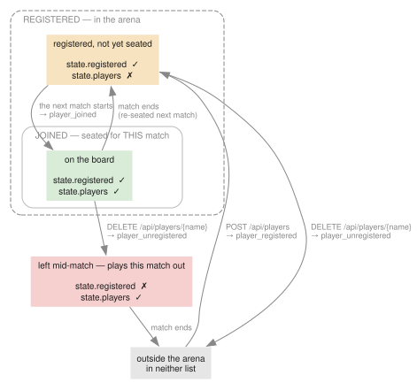
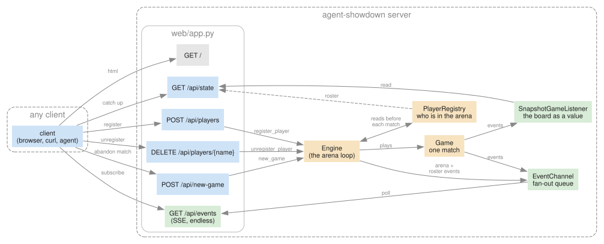
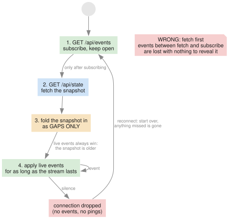
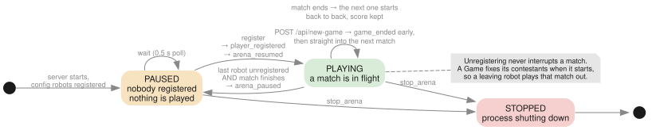
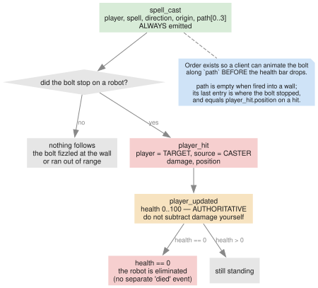
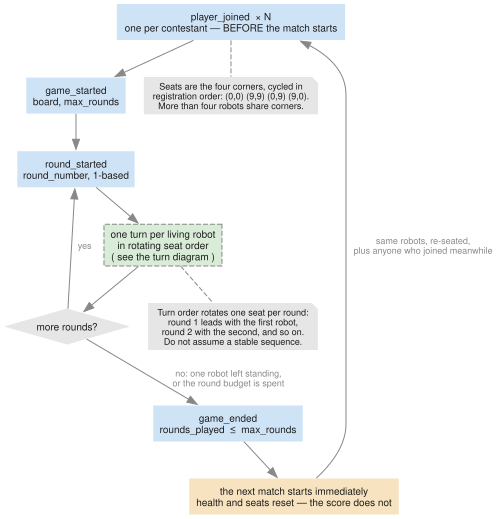
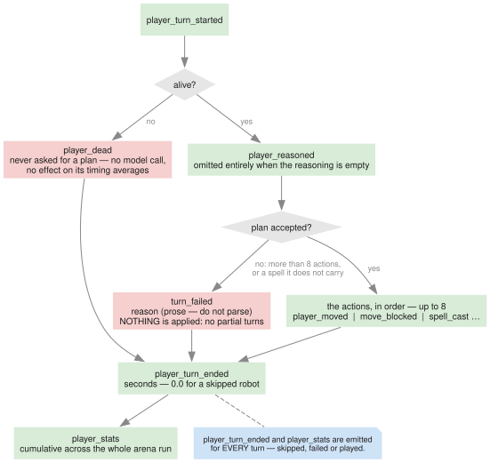

# Magic Robots — client protocol

The wire contract between the `agent-showdown` server and any client that wants to watch or
control the arena. The browser client in `web_client/` is one implementation of it; nothing here
is specific to it.

This document is derived from the server source, which remains the authority:

| Concern | Source |
|---|---|
| Routes, SSE framing | `src/agent_showdown/web/app.py` |
| Event models | `src/agent_showdown/interfaces/game/*_event.py`, union in `game_event.py` |
| Snapshot model | `src/agent_showdown/interfaces/game/game_snapshot.py` |
| Join body | `src/agent_showdown/interfaces/config/agent_config.py` |
| Rules that shape the events | `src/agent_showdown/modules/game/default_game.py` |
| Arena loop | `src/agent_showdown/modules/engine/default_engine.py` |

Every example below is captured verbatim from a running server, except where marked
*(constructed)*.

---

## 1. The model in one paragraph

The server runs an **arena** that is always on. It plays **matches** back to back for as long as
the process lives. Each match seats the robots currently **registered**, gives each of them one
**turn** per **round**, and ends when one robot is left standing or the round budget runs out.
When nobody is registered the arena **pauses** and plays nothing until somebody joins. A client
watches all of this over a one-way event stream, and can influence exactly three things: who is
registered, who is not, and when to abandon the current match.

Two words that are easy to confuse, and which the protocol keeps strictly apart:

- **Registered** — in the arena. Changes at any time, survives matches.
- **Joined** — seated on the board for one match. Happens once per robot *per match*.

They are not the same set, and a client that conflates them will draw the wrong board:



## 2. Transport

| | |
|---|---|
| Base URL | the server's origin, e.g. `http://127.0.0.1:8066` (port from `--port`, default 8066) |
| Control | HTTP/1.1, JSON request and response bodies |
| Events | Server-Sent Events over a single long-lived `GET` |
| Encoding | UTF-8 throughout. `Content-Type: application/json` for control, `text/event-stream; charset=utf-8` for the stream |
| Authentication | none. The server binds `127.0.0.1` and assumes a trusted local network |
| CORS | not configured — same-origin only |

SSE rather than WebSockets because the traffic is one-way: the server narrates, the client
listens, and the few things a client wants to say fit in ordinary POSTs.



## 3. Expected flow

```
        ┌─ GET  /            fetch the client (browsers only)
        │
        ├─ GET  /api/events  subscribe FIRST, and keep it open
        │
        └─ GET  /api/state   THEN fetch the snapshot, and fold it in as gaps only
```

**Subscribe before you fetch.** The stream has no replay. If you fetched first, any event
occurring between the fetch and the subscription would be lost with nothing to reveal it. Doing it
the other way round means the only risk is hearing something twice, which is recoverable: the
snapshot is older than anything already on the stream, so **live events always win** and the
snapshot fills gaps only.

A client that connects mid-match therefore reconstructs the board from `/api/state` and stays in
step from the stream. A client that connects to a paused arena sees `paused: true` and an empty
or stale board, and should say so rather than draw a dead arena.

The stream is **endless by design** — one connection outlives many matches. Do not treat
`game_ended` as a signal to reconnect.



## 4. Control routes

### `GET /`

Serves the built browser client as a single self-contained HTML document.

| | |
|---|---|
| Success | `200`, `text/html` |
| Failure | `500` if the client is not built (the server refuses to start in that case, so this is rare) |

Not part of the machine-facing protocol; a non-browser client never needs it.

---

### `GET /api/state`

The stream's missing half: everything a client that connected late needs in order to draw.

| | |
|---|---|
| Success | `200`, a [`GameSnapshot`](#84-gamesnapshot) |
| Idempotent | yes, no side effects |

Safe to call at any time, including while paused and before any match has run.

---

### `POST /api/players`

Registers a robot. A **paused arena resumes immediately**; a running match is unaffected, and the
robot is seated when the **next** match starts.

Request body — an [`AgentConfig`](#85-agentconfig). `Content-Type: application/json`.

| | |
|---|---|
| Success | `201`, empty body |
| Validation failure | `422`, FastAPI validation detail |
| Emits | `player_registered`, then `arena_resumed` if the arena was paused |

```bash
curl -X POST localhost:8066/api/players -H 'content-type: application/json' \
  -d '{"name":"vllm-1","base_url":"http://vllm.example/v1","model_id":"qwen3.6-35b","thinking":false}'
```

The body is `extra="forbid"`: an unknown key is a `422`, never a silently ignored typo.

```json
{"detail":[{"type":"extra_forbidden","loc":["body","bogus"],"msg":"Extra inputs are not permitted","input":1}]}
```

**Names are not checked for uniqueness.** Two robots may register under one name; they are
distinct contestants to the server but indistinguishable on the wire, since every event names a
player by string. Unregistering that name removes *all* of them. Give robots distinct names.

---

### `DELETE /api/players/{name}`

Unregisters a robot. It is **not** pulled out of the match in flight — a `Game` fixes its
contestants when it starts, so the robot plays that match out and is simply not seated again.
The arena pauses after that match if it was the last one registered.

| | |
|---|---|
| Success | `204`, empty body |
| Unknown name | `404`, `{"detail":"no player named nobody"}` |
| Emits | `player_unregistered` |

---

### `POST /api/new-game`

Abandons the match in flight. The arena deals a fresh one immediately, with full health and
starting seats. **The scoreboard survives** — wins, eliminations and deaths keep accumulating.

| | |
|---|---|
| Success | `202`, empty body |
| Body | none |
| Emits | `game_ended` for the abandoned match, then the next match's `player_joined` / `game_started` |

`202` rather than `200`: the response is sent before anything happens. The client learns the
outcome from the stream like everything else. Calling it on a paused arena is harmless and does
nothing.

---

### `GET /api/events`

The event stream. See §5.

## 5. The event stream

### 5.1 Framing

Standard SSE. Each message is a `data:` line followed by a blank line:

```
data: {"type":"round_started","round_number":1}\n\n
```

Exactly one JSON object per message. No `event:`, `id:` or `retry:` fields are ever sent, so
`EventSource` delivers everything as the default `message` type and **`Last-Event-ID` resumption
is not supported**.

Response headers:

```
content-type: text/event-stream; charset=utf-8
cache-control: no-cache
x-accel-buffering: no
Transfer-Encoding: chunked
```

`x-accel-buffering: no` stops an nginx in front of the server from buffering the stream into
uselessness.

### 5.2 Heartbeat

When no event occurs for **1.0 s** the server sends an SSE comment:

```
: ping\n\n
```

Comments are ignored by conforming SSE parsers. They keep intermediaries from timing the
connection out, and they are how the server notices the reader has gone away. A client can treat
prolonged silence — no events *and* no pings for several seconds — as a dropped connection.

### 5.3 Lifetime and reconnection

The stream ends only when the server shuts down, or when the connection drops. There is no
end-of-stream marker. On reconnect, repeat the flow in §3: resubscribe first, then re-fetch
`/api/state`, because everything that happened while disconnected is gone.

### 5.4 Delivery guarantees

- **Ordered** — events arrive in the order the server produced them.
- **At most once** — no retransmission, no acknowledgement. A dropped connection loses events.
- **Fan-out** — every connected client sees the same sequence. Nothing is per-client.

## 6. Event catalogue

All events are JSON objects with a mandatory `type` discriminator. **Every field listed is
mandatory** — the server always serializes every field, and no field is ever `null` except
`GameSnapshot.board`. Clients should nonetheless ignore unknown fields and unknown `type` values,
so the protocol can grow without breaking them.

General field conventions:

- `player` is always **who the event is about**. Where a second party exists (`player_hit`) it is
  named by a differently-named field.
- Names are `string`, UTF-8, **no declared maximum length** and no character restrictions. They
  come from configuration or a join request.
- All coordinates are [`Position`](#81-position). Never loose `x`/`y` pairs.

### 6.1 Arena events

These describe the loop around the matches, not any one match.



#### `arena_paused`

Nobody is registered, so nothing will be played until somebody joins. Emitted **once** per pause,
not repeatedly while idle.

| Field | Type | Notes |
|---|---|---|
| `type` | `"arena_paused"` | |

```json
{"type":"arena_paused"}
```

#### `arena_resumed`

A robot registered and matches begin again. Always precedes the `player_joined` of the match that
follows.

| Field | Type | Notes |
|---|---|---|
| `type` | `"arena_resumed"` | |

```json
{"type":"arena_resumed"}
```

#### `player_registered`

A robot entered the arena. Fires immediately on `POST /api/players`, including while paused.

| Field | Type | Notes |
|---|---|---|
| `type` | `"player_registered"` | |
| `player` | `string` | the robot's name |

```json
{"type":"player_registered","player":"ghost-1"}
```

#### `player_unregistered`

A robot left the arena. Only the name is carried — by this point it is all the server has.

| Field | Type | Notes |
|---|---|---|
| `type` | `"player_unregistered"` | |
| `player` | `string` | |

```json
{"type":"player_unregistered","player":"ghost-1"}
```

### 6.2 Match events

#### `player_joined`

A robot took a seat for **this match**. Emitted once per robot per match, always **before**
`game_started`.

| Field | Type | Notes |
|---|---|---|
| `type` | `"player_joined"` | |
| `player` | `string` | |
| `position` | `Position` | its starting seat |

```json
{"type":"player_joined","player":"simple-strands-vllm","position":{"x":0,"y":0}}
```

Seats are assigned by registration order from a fixed list of four corners, cycled: `(0,0)`,
`(9,9)`, `(0,9)`, `(9,0)`. More than four robots share corners.

#### `game_started`

The match is about to run.

| Field | Type | Notes |
|---|---|---|
| `type` | `"game_started"` | |
| `board` | `Board` | dimensions for this match |
| `max_rounds` | `integer` | upper bound; a match usually ends sooner |

```json
{"type":"game_started","board":{"width":10,"height":10},"max_rounds":100}
```

#### `round_started`

| Field | Type | Notes |
|---|---|---|
| `type` | `"round_started"` | |
| `round_number` | `integer` | **1-based**, increments by one |

```json
{"type":"round_started","round_number":1}
```

#### `game_ended`

| Field | Type | Notes |
|---|---|---|
| `type` | `"game_ended"` | |
| `rounds_played` | `integer` | rounds actually reached, ≤ `max_rounds`; `0` if the match was stopped before its first round |

```json
{"type":"game_ended","rounds_played":17}
```

Not a signal to reconnect or reset the client: another match normally follows within milliseconds.

### 6.3 Turn events

#### `player_turn_started`

A robot is now deciding. For a model-backed robot this can be many seconds of silence.

| Field | Type | Notes |
|---|---|---|
| `type` | `"player_turn_started"` | |
| `player` | `string` | |

```json
{"type":"player_turn_started","player":"simple-strands-vllm"}
```

#### `player_reasoned`

What the robot said about its plan, reported **before** the plan is judged — so a refused plan
still explains itself.

| Field | Type | Notes |
|---|---|---|
| `type` | `"player_reasoned"` | |
| `player` | `string` | |
| `reasoning` | `string` | model-generated prose, **no length limit**; observed values run to several hundred characters and may contain any UTF-8, including newlines |

```json
{"type":"player_reasoned","player":"simple-strands-lmstudio","reasoning":"Enemy at (5,3) is DOWN_RIGHT from my spot (4,2), exactly 1 square away and inside fireball's 3-square range — I'll burn them for 10, which levels them (10 HP)."}
```

**Omitted entirely when the reasoning is empty.** Never emitted with `reasoning: ""`.

#### `player_turn_ended`

| Field | Type | Notes |
|---|---|---|
| `type` | `"player_turn_ended"` | |
| `player` | `string` | |
| `seconds` | `number` | wall-clock duration of this turn, IEEE-754 double, e.g. `12.637461`. `0.0` for a skipped dead robot |

```json
{"type":"player_turn_ended","player":"simple-strands-lmstudio","seconds":12.637461}
```

Always emitted, including when the turn raised or was refused.

#### `player_stats`

The robot's running totals, immediately after each of its turns. Totals are **cumulative across
the whole arena run**, not per match.

| Field | Type | Notes |
|---|---|---|
| `type` | `"player_stats"` | |
| `player` | `string` | |
| `stats` | `PlayerStats` | see [§8.3](#83-playerstats) |

```json
{"type":"player_stats","player":"simple-strands-lmstudio","stats":{"turns":17,"total_seconds":256.39081899999996,"average_seconds":15.081812882352938,"eliminations":1,"deaths":0,"wins":0}}
```

Also emitted **once more** for the winner as a match ends, so a new `wins` value does not wait for
the next match to surface.

#### `turn_failed`

The robot could not be asked, or answered with something unusable. It loses its turn; the match
carries on. This is a routine occurrence, not an error condition for the client.

| Field | Type | Notes |
|---|---|---|
| `type` | `"turn_failed"` | |
| `player` | `string` | |
| `reason` | `string` | human-readable, typically `"{ExceptionType}: {message}"`. **Not machine-parseable** — do not branch on its content |

```json
{"type":"turn_failed","player":"ghost-1","reason":"AgentClientError: APIConnectionError: Connection error."}
```

Causes: an unreachable endpoint, a malformed reply, a plan longer than the action cap, or a cast
naming a spell the robot does not carry. **A refused plan applies nothing at all** — no partial
turns.

#### `player_dead`

The robot's turn came round but it has no health left, so it was skipped. It is not asked for a
plan, which costs no model call and leaves its timing averages untouched.

| Field | Type | Notes |
|---|---|---|
| `type` | `"player_dead"` | |
| `player` | `string` | |

```json
{"type":"player_dead","player":"scrapheap"}
```
*(constructed — see below)*

**Only ever seen with three or more contestants.** With two, the match ends the instant one dies,
so nobody is left to be skipped. Death itself is signalled by `player_updated` with `health: 0`,
not by this event; `player_dead` repeats every round for as long as the corpse is in the match.

### 6.4 Board events

#### `player_moved`

| Field | Type | Notes |
|---|---|---|
| `type` | `"player_moved"` | |
| `player` | `string` | |
| `source` | `Position` | where it was |
| `destination` | `Position` | where it now is, always adjacent to `source` including diagonally |

```json
{"type":"player_moved","player":"simple-strands-vllm","source":{"x":0,"y":0},"destination":{"x":1,"y":1}}
```

One event per step. A robot planning four steps emits four events in order.

#### `move_blocked`

A step would have left the board. The robot stays put and the rest of its plan continues.

| Field | Type | Notes |
|---|---|---|
| `type` | `"move_blocked"` | |
| `player` | `string` | |
| `position` | `Position` | where it remains |
| `direction` | `Direction` | the refused direction |

```json
{"type":"move_blocked","player":"simple-strands-vllm","position":{"x":0,"y":0},"direction":"DOWN_LEFT"}
```



#### `spell_cast`

A spell was cast down a direction. Purely a description of the bolt's flight — any damage follows
as separate events.

| Field | Type | Notes |
|---|---|---|
| `type` | `"spell_cast"` | |
| `player` | `string` | the caster |
| `spell` | `string` | spell name, `"fireball"` is the only one today. Treat as an open set |
| `direction` | `Direction` | |
| `origin` | `Position` | the caster's square; **not** part of `path` |
| `path` | `array<Position>` | squares travelled, in order. **0 to 3 entries** for a fireball. Empty when fired straight into a wall. The last entry is where it stopped |

```json
{"type":"spell_cast","player":"simple-strands-lmstudio","spell":"fireball","direction":"DOWN_RIGHT","origin":{"x":4,"y":2},"path":[{"x":5,"y":3}]}
```

A short `path` means the bolt stopped early — either at the board edge or on the first robot in
its way. If it hit somebody, the immediately following `player_hit.position` equals the last
`path` entry.

#### `player_hit`

| Field | Type | Notes |
|---|---|---|
| `type` | `"player_hit"` | |
| `player` | `string` | **the target** |
| `source` | `string` | the caster. May equal `player` for a self-hit |
| `spell` | `string` | |
| `damage` | `integer` | nominal damage, `10` for a fireball. May exceed the health actually lost, since health floors at 0 |
| `position` | `Position` | where the target was struck |

```json
{"type":"player_hit","player":"simple-strands-vllm","source":"simple-strands-lmstudio","spell":"fireball","damage":10,"position":{"x":5,"y":3}}
```

#### `player_updated`

A robot's health changed. **This is the authoritative health value** — do not compute health by
subtracting `damage`.

| Field | Type | Notes |
|---|---|---|
| `type` | `"player_updated"` | |
| `player` | `string` | |
| `health` | `integer` | `0`–`100`. Clamped at 0; `0` means eliminated |

```json
{"type":"player_updated","player":"simple-strands-vllm","health":0}
```

Emitted only on change. A robot at full health that is never hit produces none for the whole
match — assume `100` on join.

## 7. Ordering guarantees

These hold absolutely and a client may rely on them.



A single turn takes one of three shapes — played, refused, or skipped — and all three end the
same way:



**Arena**

```
arena_paused                     (once, while nobody is registered)
player_registered                (a robot joins the arena)
arena_resumed
  → match, match, match …        (back to back, forever)
```

**Match**

```
player_joined × N                (every contestant, before the match starts)
game_started
  round_started 1
    turn, turn, …                (one per living robot, see below)
  round_started 2
  …
game_ended
```

Turn order is **registration order rotated one seat per round**: round 1 leads with the first
robot, round 2 with the second, and so on. A client must not assume a stable per-round sequence.

**Turn — living robot**

```
player_turn_started
  player_reasoned                (omitted when the reasoning is empty)
  0..n of: player_moved | move_blocked | spell_cast [→ player_hit → player_updated]
  turn_failed                    (instead of all the above, if the plan was refused)
player_turn_ended
player_stats
```

**Turn — dead robot**

```
player_turn_started
player_dead
player_turn_ended                (seconds: 0.0)
player_stats                     (unchanged from last time)
```

**Cast**

```
spell_cast                       (always)
  player_hit                     (only if it struck somebody)
  player_updated                 (only after a hit)
```

`spell_cast` precedes the damage precisely so a client can animate the bolt before dropping a
health bar.

## 8. Shared types

### 8.1 `Position`

| Field | Type | Notes |
|---|---|---|
| `x` | `integer` | column, `0` … `board.width - 1` |
| `y` | `integer` | row, `0` … `board.height - 1` |

**`(0,0)` is the top-left.** `UP` decreases `y`; `DOWN` increases it.

### 8.2 `Board`

| Field | Type | Notes |
|---|---|---|
| `width` | `integer` | `10` today |
| `height` | `integer` | `10` today |

Read the dimensions from the event. They are not guaranteed to stay 10×10.

### 8.3 `PlayerStats`

| Field | Type | Notes |
|---|---|---|
| `turns` | `integer` | turns that *started* while the robot was alive. Failed and refused turns count; skipped dead turns do not |
| `total_seconds` | `number` | cumulative wall seconds |
| `average_seconds` | `number` | `total_seconds / turns`, or `0.0` before the first turn |
| `eliminations` | `integer` | opponents this robot brought to 0. A self-hit elimination counts for nobody |
| `deaths` | `integer` | times brought to 0 |
| `wins` | `integer` | matches won |

All six are cumulative across the whole arena run and survive `POST /api/new-game`. They reset
only when the server restarts.

### 8.4 `GameSnapshot`

Returned by `GET /api/state`. Every field has a default, so the object is well-formed before
anything has happened.

| Field | Type | Default | Notes |
|---|---|---|---|
| `board` | `Board \| null` | `null` | **the only nullable field in the protocol.** `null` before the first match |
| `max_rounds` | `integer` | `0` | of the current or last match |
| `round_number` | `integer` | `0` | current round, 1-based; `0` before the first |
| `playing` | `boolean` | `false` | a match is in progress |
| `paused` | `boolean` | `false` | the arena has nobody registered |
| `players` | `array<PlayerSnapshot>` | `[]` | who is **on the board** for the current or last match |
| `registered` | `array<string>` | `[]` | who is **in the arena**, in join order |

`players` and `registered` differ legitimately and often: a robot that just registered is in
`registered` but not yet in `players`; a robot that left mid-match is in `players` until that
match ends.

**`players` order is not stable.** Updating a robot moves it to the end. Sort by name for display.

`PlayerSnapshot`:

| Field | Type | Default | Notes |
|---|---|---|---|
| `name` | `string` | — | |
| `position` | `Position` | — | |
| `health` | `integer` | `100` | |
| `reasoning` | `string` | `""` | its most recent explanation |
| `think_seconds` | `number` | `0.0` | duration of its **last** turn only, not a total |

Sample:

```json
{
  "board": {"width": 10, "height": 10},
  "max_rounds": 100,
  "round_number": 2,
  "playing": true,
  "paused": false,
  "players": [
    {"name": "simple-strands-vllm", "position": {"x": 0, "y": 0}, "health": 100,
     "reasoning": "I'll start with a fireball aimed UP_RIGHT…", "think_seconds": 5.67813}
  ],
  "registered": ["simple-strands-vllm", "simple-strands-lmstudio"]
}
```

### 8.5 `AgentConfig`

The `POST /api/players` body. Identical to an entry under `agents:` in `agent-showdown.yaml`, so a
robot is described the one way whichever route it arrives by. `extra="forbid"`.

| Field | Type | Required | Default | Notes |
|---|---|---|---|---|
| `name` | `string` | **yes** | — | how the robot appears in every event. Not checked for uniqueness |
| `base_url` | `string` | **yes** | — | an OpenAI-compatible endpoint, including `/v1` |
| `model_id` | `string` | **yes** | — | model name as that endpoint knows it |
| `api_key` | `string` | no | `"EMPTY"` | servers needing no auth still need a value |
| `max_tokens` | `integer` | no | `4096` | output budget; reasoning is spent from it |
| `timeout` | `number` | no | `300.0` | seconds per model call |
| `max_actions` | `integer` | no | `4` | what the *prompt* asks for. Must be ≤ 8, the rules' cap, or every turn is refused whole |
| `thinking` | `boolean` | no | `true` | `false` is worth minutes per turn |

No field has a declared length or range constraint. `name` in particular is unbounded.

### 8.6 `Direction`

A string enum, exactly one of:

```
UP  DOWN  LEFT  RIGHT  UP_LEFT  UP_RIGHT  DOWN_LEFT  DOWN_RIGHT
```

Diagonals move both axes at once. Deltas are a rule of the board, not a property of the word:
`UP` is `(0,-1)`, `DOWN_RIGHT` is `(+1,+1)`, and so on.

## 9. Constants and limits

Values the protocol currently exhibits. Those marked **fixed** are guaranteed by the rules; the
rest are configuration or implementation detail and a client should read them from the wire where
it can.

| Value | Today | Status | Source |
|---|---|---|---|
| Board | 10 × 10 | configurable in code | `_BOARD` |
| Starting health | 100 | **fixed** | `_MAX_HEALTH` |
| Health floor | 0 | **fixed** | clamped in `_damage` |
| Actions per turn | ≤ 8 | **fixed** | `_MAX_ACTIONS_PER_TURN` |
| Fireball range | 3 squares | **fixed** for this spell | `_RANGE` |
| Fireball damage | 10 | **fixed** for this spell | `_DAMAGE` |
| Rounds per match | 100 | configurable (`max_rounds`) | `agent-showdown.yaml` |
| Seats | 4 corners, cycled | implementation | `_SEATS` |
| SSE heartbeat | 1.0 s | implementation | `_HEARTBEAT_SECONDS` |
| Idle poll while paused | 0.5 s | implementation | `_IDLE_TIMEOUT` |
| Shutdown grace | 5.0 s | implementation | `_SHUTDOWN_SECONDS` |

**There are no declared maximum lengths anywhere in the protocol.** Names, spell names, reasoning
and failure reasons are unbounded UTF-8 strings. `reasoning` is model-generated and routinely runs
to several hundred characters. A client that renders these must handle arbitrary length and
arbitrary content, including newlines and characters outside the BMP.

Numeric types: integers are JSON numbers with no fractional part and fit comfortably in a 32-bit
signed range in practice. `seconds`, `total_seconds` and `average_seconds` are IEEE-754 doubles
serialized at full precision — expect values like `256.39081899999996`, and round for display.

## 10. Errors

| Status | When | Body |
|---|---|---|
| `404` | `DELETE` of an unknown player | `{"detail":"no player named X"}` |
| `422` | malformed or extra fields in a join body | FastAPI validation detail array |
| `500` | unexpected server fault | FastAPI default |

There is **no error event type**. Nothing that goes wrong inside a match reaches the client as an
error: a broken robot produces `turn_failed` and the match carries on. A client should treat
`turn_failed` as normal narration, not as a fault to surface loudly.

## 11. Compatibility

The protocol is unversioned. There is no negotiation, no version header, and no capability
exchange — client and server are expected to ship together.

Clients should nevertheless be written to tolerate growth:

- **Ignore unknown `type` values.** New events are added as the game grows; a client that throws
  on one it does not recognise will break on the next release.
- **Ignore unknown fields** on known events.
- **Do not exhaustively switch without a fallback.** In TypeScript, an exhaustive `switch` over
  the `GameEvent` union will not compile once a variant is added, which is the intended pressure —
  but the runtime path must still return sensibly if a server sends something newer than the
  client knows.
- **Do not parse human-readable strings.** `reasoning` and `turn_failed.reason` are prose and
  will change wording without notice.

When adding an event server-side, all of these must change together, or the two sides drift:
the Python event model, the `GameEvent` union, `GameListener` and all its implementations, and the
TypeScript mirror in `web_client/src/interfaces/game/game-event.ts`.
